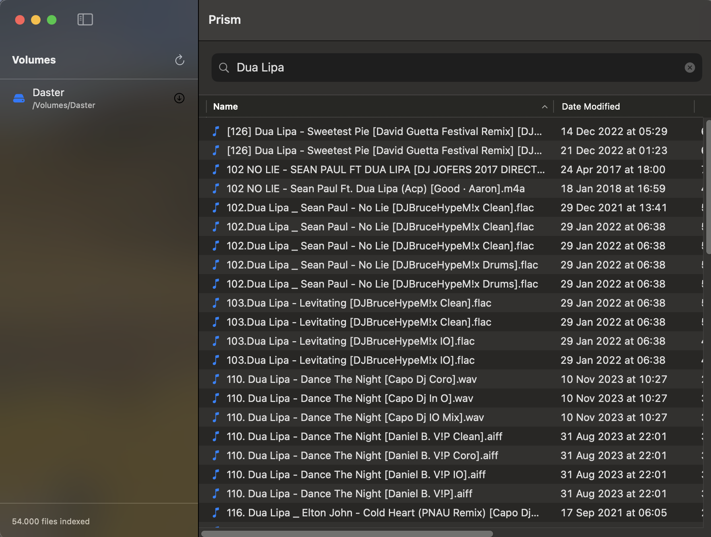

# Prism

> Lightning-fast file search for macOS — a native alternative to Windows' "Everything" search tool

Prism is a high-performance desktop search utility for macOS that maintains a tiered database architecture to enable instant filename search across massive audio libraries (5M+ files) on external drives.



## Features

- **Instant Search**: Sub-20ms search latency using SQLite FTS5 + in-memory cache
- **External Drive Support**: Index and search files on external drives, even when offline
- **Audio-Focused**: Specialized indexing for audio file formats (MP3, WAV, FLAC, and more)
- **Volume UUID Tracking**: Handles drive renaming without re-indexing
- **Parallel Scanning**: `getattrlistbulk` with multi-worker BFS for maximum throughput
- **Tiered Storage**: DuckDB (metadata) + SQLite FTS5 (search index) + in-memory cache

## Performance

### Full pipeline (27,604 audio files, 2TB USB ExFAT drive)

| Stage | Time | % of pipeline |
|-------|------:|---------------:|
| USB I/O + scan | 5.26s | 67% |
| mergeAndDiff (DuckDB staging → files) | 1.40s | 18% |
| Incremental SQLite + FTS5 sync | 0.88s | 11% |
| loadCache (first scan only) | 0.26s | 3% |
| **Total first-scan ingestion** | **7.80s** | |
| Search `amor` (834 results, warm cache) | **~8ms** | |

> ~70% of first-scan time is USB I/O. The code (DuckDB + FTS5 + cache)
> completes in ~2.5s of that 7.8s. On internal SSD, the same 27K files would
> ingest in ~2–3s.

### Scanner throughput (7,800 files, internal SSD)

| Approach | Throughput | vs FileManager |
|----------|-----------|----------------|
| `FileManager` (original) | 112K files/sec | 1.0x |
| `getattrlistbulk` serial | 623K files/sec | 5.6x |
| `getattrlistbulk` parallel (8 workers) | 1,530K files/sec | **14x** |

### Search latency (27,604 files, warm cache)

| Query | FTS5 | Cache | Total | Results |
|-------|------:|------:|------:|------:|
| `daster` (specific) | 1.5ms | 0.0ms | 1.5ms | 4 |
| `jorge` | 1.8ms | 0.0ms | 1.8ms | 26 |
| `amor` | 7–8ms | 0.5ms | 7–8ms | 834 |
| `am` (broad) | 7ms | 0.6ms | 7.6ms | 1000 (capped) |
| `a` (broad) | 46ms | 0.6ms | 47ms | 1000 (capped) |
| `d` (broad) | 96ms | 3.5ms | 100ms | 1000 (capped) |

Narrow queries complete in under 10 ms end-to-end including GCD + MainActor
hops. Broad prefixes hit the 1 000-result cap where BM25 ranking dominates
and latency scales with candidate-set size.

### Optimization breakdown

| Optimization | Impact |
|---|---|
| `getattrlistbulk` (replaces `FileManager`) | ~5x fewer syscalls per directory |
| Parallel BFS (4-8 workers) | 2.5x on SSD, ~1.5x on USB |
| Producer-consumer `AsyncStream` pipeline | Scan and DuckDB write overlap |
| Batched DuckDB Appender (5K rows/flush) | 0.80s for 27K rows |
| Staging-table merge (id-keyed) | Keeps Appender throughput while giving upsert semantics |
| Hash-derived stable IDs | Same Int64 across rescans; no PK churn |
| Incremental FTS5 sync via existing triggers | O(delta) per rescan |
| In-memory cache for search results | 0.3ms vs 200ms DuckDB point lookup |
| Multi-connection DuckDB (1 writer + 3 readers) | Search stays responsive during active scans |
| `ScanDiff` carries full row payload | `applyDiff` builds `SearchResult` in-memory; no DuckDB refetch. Saves ~6s on Clear→rescan. |

### Search during scan (multi-connection DuckDB)

| scenario | warm cache-hit p99 | overhead vs idle |
|---|---:|---:|
| Search, no scan in flight | 1.63 ms | 1.00× |
| Search, while 50K-row scan ingesting | 1.92 ms | **1.18×** |

Before this change, readers queued behind the writer's `Appender.flush()` and
could block for seconds during a scan burst. The writer + 3-reader pool
architecture lets searches proceed on their own MVCC snapshots — the writer
queue only serializes *writes*, not *reads*. Hot-path cache-hit search stays
under 2 ms p99 even mid-scan.

### Incremental rescan (Sync v2)

Rescanning an unchanged volume is near-instant, and Clear-then-rescan is
bounded by scan I/O + SQLite sync. Same 27,604-file USB drive:

| Scan | Scan I/O | Merge + sync + applyDiff | Total |
|---|---:|---:|---:|
| First scan (all 27K added, fresh DB) | 5.26s | 2.54s | 7.80s |
| Unchanged rescan (empty diff) | 0.99s | **0.42s** | **1.43s** |
| Clear Index → rescan | 0.75s | **2.73s** | **3.51s** |

The Clear→rescan path used to take 9s+ because `applyDiff` made 28 chunked
`IN (...)` point lookups against DuckDB to rebuild the cache (~200ms each).
`ScanDiff.Entry` now carries the full row payload harvested at merge time,
so `applyDiff` is a pure in-memory dictionary update: **6.00s → 0.01s**.

Merge time is proportional to `|added ∪ modified ∪ removed|`, not to the
volume size. A rescan that adds 10 files and removes 3 completes in
milliseconds of DB work regardless of library size.

## Supported Audio Formats

**Common**: mp3, wav, flac, aac, m4a, ogg, wma, aiff, aif

**Advanced**: ape, opus, alac, dsd, dsf, mp2, mpc, wv, tta, ac3, dts

## Requirements

- macOS 14.0 (Sonoma) or later
- Xcode 15.0+ (for building from source)

## Installation

### From Source

```bash
git clone https://github.com/jotarios/prism.git
cd prism/prism
open prism.xcodeproj
```

Build and run using Xcode (Cmd+R) or command line:

```bash
xcodebuild -scheme prism -configuration Release
```

## Usage

1. **Launch Prism** and connect your external drives
2. **Scan a volume** by clicking the scan button next to a volume in the sidebar
3. **Search instantly** as files are indexed — just start typing in the search bar
4. **Open files** by double-clicking results or use QuickLook (Spacebar)

## Architecture

```
INGESTION:
  getattrlistbulk ───▶ AsyncStream ───▶ DuckDB Appender ──▶ files_staging_<volume>
  (parallel BFS)                                                │
                                                     mergeAndDiff (set-based SQL)
                                                                │
                                                                ▼
                                                      ┌────────────────────┐
                                                      │  DuckDB `files`    │
                                                      │  id = PathHash(vol,│
                                                      │       path) — PK   │
                                                      └─────────┬──────────┘
                                                                │ ScanDiff
                                      ┌─────────────────────────┼──────────────┐
                                      ▼                                        ▼
                        Incremental SQLite sync (O(delta))          cache.applyDiff
                        triggers update FTS5 per row               (Dictionary patch)

SEARCH:
  User types ──▶ FTS5 prefix match ──▶ IDs ──▶ in-memory cache ──▶ results
```

### Core Components

- **BulkScanner**: Low-level `getattrlistbulk` BSD syscall wrapper for batch file attribute retrieval
- **ParallelScanCoordinator**: Actor-based parallel BFS with bounded concurrency (8 workers internal, 4 external)
- **PathHash**: FNV-1a 64-bit hash of `(volume_uuid, path)`. Deterministic, stable across runs — a file keeps its Int64 id forever.
- **DuckDBStore**: Persistent metadata store. Per-volume staging tables receive scan writes via Appender; `mergeAndDiff` computes added/modified/removed in one transaction.
- **SQLite/FTS5**: Full-text search index, kept in sync incrementally via existing per-row triggers.
- **In-memory Cache**: Dictionary keyed by Int64 id; patched via `applyDiff` on every scan.

### Key Design Decisions

- **`getattrlistbulk` over `FileManager`**: 14x faster scanning by batching ~500 file attributes per kernel call
- **`loadUnaligned(as:)` for buffer parsing**: Packed attribute buffers are not aligned to natural boundaries
- **DuckDB for metadata, SQLite for search**: Each database does what it's best at
- **Staging-table merge, not `INSERT ON CONFLICT`**: DuckDB's upsert path degrades nonlinearly with table size ([duckdb#11275](https://github.com/duckdb/duckdb/issues/11275)); staging keeps Appender throughput and gets correctness via a single set-based merge
- **Hash-derived IDs** (`id = FNV-1a(volume || path)`): Collision risk ~7e-9 at 5M files; gives us stable identity across rescans and disappearance/reappearance cycles
- **Triggers stay in place during incremental sync**: per-row trigger fires are cheap at O(delta). Full-rebuild path drops them for bulk inserts, as before.
- **Startup checks**: Trigger integrity (crash during bulk import) + orphan staging cleanup (crash mid-scan)

## Development

### Building

```bash
xcodebuild -scheme prism -configuration Debug
```

### Testing

```bash
xcodebuild test -scheme prism
```

### Project Structure

```
prism/
├── Database/
│   ├── DatabaseManager.swift    # SQLite/GRDB FTS5 search index + incremental sync
│   ├── DuckDBStore.swift        # DuckDB metadata store + staging-table merge
│   └── PathHash.swift           # Stable 64-bit FNV-1a of (volume, path)
├── Scanner/
│   ├── BulkScanner.swift        # getattrlistbulk wrapper + skip list
│   ├── ParallelScanCoordinator.swift  # Parallel BFS actor
│   └── VolumeManager.swift      # Volume discovery & UUID
├── Models/
│   ├── FileRecord.swift         # SearchResult, FileRecordInsert, ScanDiff, SyncRecord
│   └── VolumeInfo.swift         # Volume metadata
├── ViewModels/
│   └── SearchViewModel.swift    # Central state, dual-DB search + scan pipeline
└── Views/
    ├── MainWindow.swift         # NavigationSplitView root
    ├── SidebarView.swift        # Volume list + scan buttons
    ├── SearchBarView.swift      # Search input with debounce
    ├── ResultsTableView.swift   # Sortable results table
    ├── SettingsView.swift       # Per-volume management
    └── QuickLookPreview.swift   # Spacebar file preview
```

### Running Benchmarks

```bash
# Scanner: FileManager vs getattrlistbulk vs parallel
xcodebuild test -scheme prism -only-testing:prismTests/ScannerBenchmark

# DuckDB: Appender throughput + point lookup latency
xcodebuild test -scheme prism -only-testing:prismTests/DuckDBStoreTests

# Full pipeline: scan → DuckDB → FTS5 sync → search
xcodebuild test -scheme prism -only-testing:prismTests/IntegrationTests

# Scale comparison: FTS5+Cache vs DuckDB-only vs brute force
xcodebuild test -scheme prism -only-testing:prismTests/ScaleTests
```

## Contributing

Contributions are welcome! Please feel free to submit a Pull Request.

1. Fork the repository
2. Create your feature branch (`git checkout -b feature/amazing-feature`)
3. Commit your changes using [Conventional Commits](https://www.conventionalcommits.org/) format
4. Push to the branch (`git push origin feature/amazing-feature`)
5. Open a Pull Request

## Roadmap

- [x] **MVP**: Basic UI, file scanner, database, instant search
- [x] **Ingestion v2**: `getattrlistbulk`, parallel scanning, DuckDB tiered storage
- [x] **Sync v2**: Incremental FTS5 sync, hash-derived stable IDs, staging-table merge, incremental cache patching
- [ ] **Phase 3**: FSEvents monitoring, auto-indexing on drive mount
- [ ] **Phase 4**: ID3 tag metadata extraction (artist, album, genre, duration), drag-and-drop
- [ ] **Phase 5**: Advanced filters, offline drive handling, user-configurable ignore-directory list (currently a static `Set<String>` on `BulkScanner`)
- [ ] **Phase 6**: Semantic search — query by mood, genre, or concept ("sad songs", "workout music"). ID3 genre/mood tags + filename-based artist lookup + optional local LLM enrichment for untagged files. Hybrid approach: three tiers of coverage depending on available metadata

## Architecture TODOs

Known limitations and planned improvements from internal review. Ordered by impact.

### Concurrency & throughput

- [ ] **Multi-connection DuckDB (1 writer + N readers)** — today a single `NSLock`-protected `Connection` serializes every read/write, so search blocks on `ingestBatch` during a scan. Open dedicated reader connections and drop the lock to reader-writer semantics. Biggest UX win: search-during-scan.
- [ ] **Unblock search during active scans** — until multi-connection lands, route search through a read-only snapshot or disable the search bar with a clear UI affordance instead of queuing behind the ingest writer.
- [ ] **Cancellable scan workers** — `ParallelScanCoordinator.cancel()` only checks between task-group iterations; in-flight `BulkScanner.scanDirectory` blocking syscalls run to completion. Cancel is currently "eventually stops," not "stops now."
- [ ] **Backpressured AsyncStream (SE-0406)** — current stream uses `.unbounded`, which is correct but lets RAM grow if the DuckDB writer stalls. Migrate once the Swift version allows.

### Indexing

- [x] **Incremental FTS5 sync** — landed in Sync v2. `DatabaseManager.syncSearchIndex(from:volumeUUID:diff:)` applies only the per-scan diff. Rescans of unchanged volumes drop from O(N) to O(0).
- [ ] **Shard DuckDB by volume** — one `.duckdb` file per volume UUID. Natural partitioning, parallel ingest across volumes, and detaching an offline drive becomes a file-level operation.
- [ ] **Evaluate SQLite-only ingestion path** — DuckDB's Appender is fast but SQLite WAL + prepared statements may be close enough to drop DuckDB from the ingestion hot path and keep it for analytics only.

### Memory

- [ ] **Bounded / LRU result cache** — cache is now patched incrementally via `applyDiff` rather than reloaded wholesale, but size is still unbounded. At 5M files × ~200 B/entry ≈ 1 GB resident with no eviction. Switch to a bounded LRU keyed by the most recent FTS5 result sets, or drop the cache tier and benchmark end-to-end.

### Code organization

- [ ] **Split `SearchViewModel`** — ~230-line `@MainActor` god object owning volumes, DBs, scan pipeline, FTS sync, and search. Split into:
  - `IndexService` (non-MainActor actor): owns the stores, scan pipeline, FTS sync.
  - `SearchService` (actor): query + cache.
  - Thin `@MainActor SearchViewModel`: holds only `@Published` UI state.
  - Eliminates the `await MainActor.run { self.duckDBStore }` hops that are a symptom of isolation mismatch.

### Testing

- [x] **Fix stale test suites** — done; all suites on current APIs. `IncrementalSyncTests` and `IncrementalSyncDatabaseManagerTests` added to cover the Sync v2 invariants (id stability, empty-diff rescan, volume isolation, orphan staging cleanup).
- [ ] **Test isolation for singleton `DatabaseManager`** — tests that use `DatabaseManager.shared` flake under `xcodebuild -parallel-testing-enabled YES` (default) because multiple test processes share the on-disk `index.db`. Currently worked around by running with `-parallel-testing-enabled NO`. Proper fix is to make `DatabaseManager` instantiable with a per-test path.
- [ ] **Concurrency stress tests** — add a test that runs a scan and a flood of searches concurrently to lock in the DuckDB serialization invariant and detect future regressions.

## License

MIT License - see [LICENSE](LICENSE) file for details

## Acknowledgments

- Inspired by [Everything](https://www.voidtools.com/) for Windows
- Uses [GRDB.swift](https://github.com/groue/GRDB.swift) for SQLite access
- Uses [DuckDB](https://github.com/duckdb/duckdb-swift) for columnar metadata storage
- Built with Swift and SwiftUI
